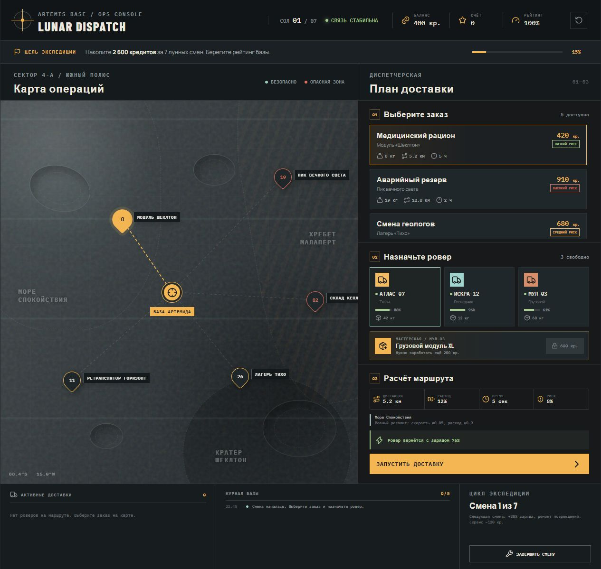

# Lunar Dispatch

Небольшой тактический симулятор лунной доставки. Игрок управляет флотом базы «Артемида»: выбирает заказы на карте Южного полюса Луны, сопоставляет груз с возможностями роверов и рискует ради более выгодных контрактов.



## Запуск

Нужен Node.js 20+.

```bash
npm install
npm run dev
```

Откройте адрес, который покажет Vite (обычно `http://localhost:5173`).

Проверки production-версии:

```bash
npm test
npm run lint
npm run build
```

## Правила игры

Цель — накопить 2 600 кредитов за 7 смен и набрать максимальный счёт, не обнулив рейтинг базы.

1. Выберите точку заказа на карте или карточку в диспетчерской.
2. Назначьте свободный ровер. Интерфейс сразу показывает несовместимые варианты и причину запрета.
3. Проверьте расход батареи, время и риск маршрута, затем запустите доставку.
4. Ровер перемещается по карте в реальном времени. Успешная доставка даёт награду и очки; авария снижает рейтинг и повреждает ровер.
5. Завершение смены заряжает и ремонтирует свободный флот, но стоит 120 кредитов.

Контейнер резерва массой 82 кг невозможно доставить стартовым флотом: лучший ровер поднимает только 68 кг. После нескольких контрактов игрок может купить в мастерской грузовой модуль XL за 600 кредитов, увеличить лимит МУЛ-03 до 90 кг и открыть этот маршрут. Так обязательный невозможный сценарий превращается в понятную цель развития.

## Логика расчёта

Расчёты находятся в `src/game/game.ts` и не зависят от React.

- Отношение веса к грузоподъёмности создаёт штраф: тяжёлый груз увеличивает время и расход энергии.
- У каждой зоны есть свои множители скорости и энергии, а также добавка к вероятности аварии.
- Маршрут нельзя запустить, если заказ тяжелее лимита, батареи меньше расчётного расхода, ровер занят/повреждён или заказ уже выполняется.
- Риск складывается из риска заказа, сложности зоны и загрузки ровера. После прибытия он определяет успех или аварию.
- При успехе меняются баланс, счёт, батарея, рейтинг и статус заказа. При аварии награда не выплачивается, заказ теряется, ровер повреждается, рейтинг падает.
- Срочность увеличивает количество очков за успешный заказ.

Пример формулы расхода:

```text
energy = distance × terrainEnergy × (1 + loadRatio × 0.72) × 2.15
```

## Хранение данных

Состояние хранится как версионированная JSON-структура в `localStorage` под ключом `lunar-dispatch-state-v1`. В ней четыре требуемые сущности:

- `rovers` — характеристики, батарея и статус роверов;
- `orders` — груз, награда, срочность, риск, координаты и статус заказов;
- `deliveries` — активные и завершённые рейсы, прогресс и результат;
- `events` — журнал действий и происшествий базы.

Также сохраняются день, баланс, очки, рейтинг и описание зон. Кнопка в правом верхнем углу сбрасывает сохранённую экспедицию.

## Что реализовано

- адаптивная тактическая карта без платного картографического API;
- пять точек заказов, три типа рельефа и три разных ровера;
- анимированное движение роверов и прогресс рейса;
- реальные невозможные сценарии по весу, батарее и статусу;
- вероятностные аварии, ремонт, зарядка, экономика и семидневная цель;
- улучшение грузового ровера, открывающее недоступный в начале заказ;
- журнал событий и сохранение после каждого изменения;
- 15 автоматических тестов игровой логики и базового состава интерфейса;
- desktop и mobile layouts, keyboard focus и режим reduced motion.

## Технологии

React 19, TypeScript, Vite, Vitest, Lucide Icons и CSS без UI-фреймворка. Карта, текстура реголита, маршруты и маркеры сделаны собственными CSS/SVG-средствами, поэтому внешние графические ассеты не нужны. Google Fonts используются только для типографики; при отсутствии сети применяются системные fallback-шрифты.

## Использование AI

AI использовался как помощник при проектировании игровой механики, создании визуального направления, написании кода и тест-кейсов. Готовые AI API в работающем приложении не используются: игра полностью работает локально и не требует ключей или платных сервисов.

## Скриншоты

- [`screenshots/briefing.png`](screenshots/briefing.png) — вводный брифинг;
- [`screenshots/gameplay.png`](screenshots/gameplay.png) — основной экран;
- [`screenshots/delivery-active.png`](screenshots/delivery-active.png) — доставка в пути;
- [`screenshots/upgrade-installed.png`](screenshots/upgrade-installed.png) — установленный грузовой модуль;
- [`screenshots/mobile.png`](screenshots/mobile.png) — мобильная версия.
